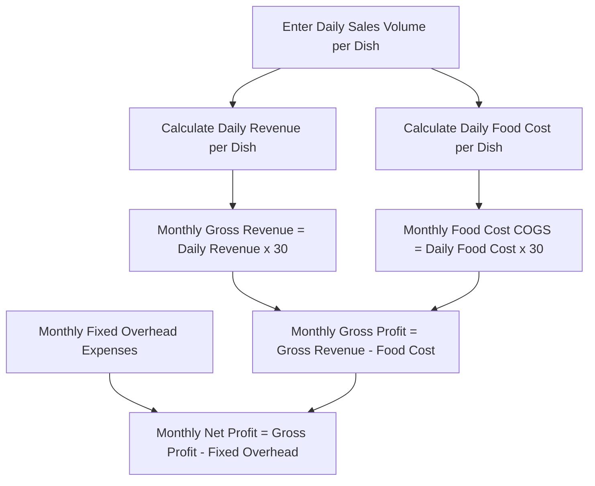

# User Guide: Sales Simulator and Net Profit Projections

This guide explains how to use the interactive sales volume simulator to run monthly financial projections and determine how many units of each menu item you need to sell daily to cover your overheads and generate a net profit.

---

## 📈 What is the Sales Simulator?

The **Simulator** is an interactive dashboard that combines the financial data of your recipes (sale prices and food costs) with your fixed operating expenses (rent, utilities, salaries). It generates a detailed forecast of monthly revenues and net profits under different daily sales scenarios.

---

## 🖥️ Simulator Interface

Tap the **Simulator** tab (the uptrend chart icon `TrendingUp`) to open the projection panel:

1. **Simulated Monthly Projection Panel**: Located at the top, displaying four global financial indicators:
   * **Gross Revenue**: Estimated total sales accumulated over a 30-day operating period.
   * **Food Cost (COGS)**: Estimated total cost of raw ingredients consumed over 30 days.
   * **Local Fixed Overhead**: The total monthly operating expenses imported from the **Expenses** tab.
   * **Net Profit**: The actual money remaining in your pocket after covering all costs.
2. **Save Button**: Located in the middle-right area, allowing you to save your sales simulation to the database.
3. **Menu Item List (Estimated Daily Sales)**: Individual cards for each recipe in your menu, featuring input fields to adjust daily sales volumes.

---

## ⚙️ Simulating Sales Volume Step-by-Step

1. For each dish, you will find a number input box labeled `/day` on the right side of the card.
2. Tap the box and enter the average number of units you sell (or plan to sell) in a single day for that item (e.g., `25` Cheeseburgers, `15` Combo Meals).
3. As you enter or modify these numbers, you will notice that the values in the **Simulated Monthly Projection Panel** at the top update instantly.
4. The bottom of each recipe card displays its daily financial subtotal:
   * **Daily Revenue**: $\text{Sale Price} \times \text{Units Sold}$.
   * **Daily Gross Profit**: $\text{Profit Margin per Dish} \times \text{Units Sold}$ (highlighted in green).

> [!TIP]
> If you do not plan to sell a specific item or if it is a seasonal product that is not currently offered, simply keep its daily volume set to `0`.

---

## 📐 Formulas and Financial Calculations

The application uses the following mathematical logic to project monthly results, assuming a standard **30-day month**:

### 1. Monthly Gross Revenue
This represents the total sales generated by the business before any costs are subtracted:
$$\text{Monthly Gross Revenue} = \sum (\text{Sale Price of each Recipe} \times \text{Daily Volume}) \times 30$$

### 2. Monthly Food Cost (Monthly COGS)
The total cost of raw materials required to support the simulated sales volume:
$$\text{Monthly Food Cost} = \sum (\text{Ingredient Cost of each Recipe} \times \text{Daily Volume}) \times 30$$

### 3. Monthly Gross Profit
The earnings remaining after subtracting ingredient costs, before paying local operating expenses:
$$\text{Monthly Gross Profit} = \text{Monthly Gross Revenue} - \text{Monthly Food Cost}$$

### 4. Monthly Net Profit
The actual bottom-line profit of your food business:
$$\text{Monthly Net Profit} = \text{Monthly Gross Profit} - \text{Monthly Fixed Overhead}$$

---

## 🚦 Financial Viability Traffic Light (Net Profit)

The **Net Profit** indicator in the top panel dynamically changes color to reflect your financial status:

* 🟢 **Green (Positive / Profit)**: Your daily sales volumes generate enough gross profit to cover your food costs and your fixed overheads, leaving a positive net profit.
* 🔴 **Red (Negative / Loss)**: Your daily sales are insufficient to cover your fixed operating expenses. You need to increase sales volumes, adjust retail prices, or reduce operating costs to reach break-even.

---

## 💾 Saving Projections and Dashboard Integration

Once you have configured a realistic sales scenario, tap the **"Save"** button (the diskette icon `Save`):

1. A green alert box will appear reading: **"Projections saved successfully!"**.
2. **Dashboard Sync**: Saving this projection writes the daily sales volumes to your user profile. When you navigate back to the **Home** (Dashboard) tab, the main **Monthly Profitability (Projected Net)** indicator will update with this simulated net profit, allowing you to track your targets from the home screen.
