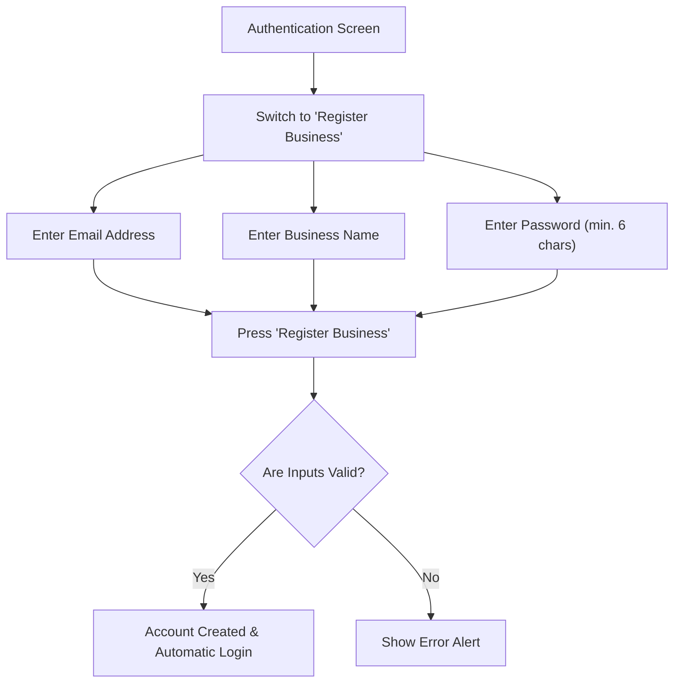

# User Guide: Registration, Login, and Business Configuration

This guide provides step-by-step instructions for creating your account, logging into the platform, configuring your fast-food business profile, and installing the application on your mobile device for the best user experience.

---

## 📱 Mobile PWA (Progressive Web App) Installation

The **Cost Estimator** is designed with a mobile-first approach and operates as a **PWA (Progressive Web App)**. This allows you to install it directly onto your smartphone without going through an app store. It runs in full-screen mode, providing a native app experience.

### How to Install on Android (Google Chrome):
1. Ensure your computer (hosting the server) and your mobile phone are connected to the **same Wi-Fi network** (or access the application's public URL).
2. Open **Google Chrome** on your mobile device and enter the network IP address and port provided by the development console (e.g., `http://192.168.1.45:5173`).
3. Tap the **three-dot menu button** in the top-right corner of the browser.
4. Select **"Add to Home screen"** or **"Install app"**.
5. Confirm the installation. Within a few seconds, the application icon will appear on your phone's home screen. Opening it will launch the app without the browser's address bar.

### How to Install on iOS (Apple Safari):
1. Open **Safari** on your iPhone and navigate to the application's URL.
2. Tap the **Share** button (the square icon with an upward arrow) at the bottom navigation bar.
3. Scroll down and select **"Add to Home Screen"**.
4. Tap **"Add"** in the top-right corner to confirm. The app will now be available on your home screen.

> [!NOTE]
> The application automatically adapts to safe areas on modern mobile displays (utilizing `safe-area-inset-bottom` styling), ensuring navigation and interactive elements do not conflict with device operating system gestures.

---

## 🔐 Registering a New Account

If you are using the application for the first time, you must register your business.

### Step-by-Step Registration:
1. Open the application on your device. The **Welcome Back!** login screen is shown by default.
2. Tap the link at the bottom: **"Don't have an account? Register here"**.
3. The form title will change to **Create Your Account**.
4. Fill in the required details:
   * **Email Address**: Your contact email (e.g., `admin@donpepe.com`).
   * **Business Name**: The commercial name of your establishment (e.g., `Don Pepe Burgers`). This name will appear in the header across all sections of the application.
   * **Password**: Create a secure password.
5. Tap the **"Register Business"** button.

> [!IMPORTANT]
> **Validation Rules:**
> * The password must be at least **6 characters** long.
> * All fields are mandatory. If any validation fails, a red alert box will display the error message (e.g., *"Password must be at least 6 characters long"*).

---

## 🔑 Logging In (Signing In)

Once your business is registered, you can log in from any compatible device:

1. On the authentication screen, make sure the title reads **Welcome Back!**. If it doesn't, tap the link at the bottom: **"Already have an account? Log in"**.
2. Enter your registered **Email Address** and **Password**.
3. You can toggle the visibility of your password by tapping the **Eye icon** on the right side of the password input field.
4. Tap the **"Log In"** button. A loading indicator will appear while your credentials are validated and your session is initialized.

---

## 🏢 Business Profile and Header

Once logged in, a fixed header bar is displayed at the top of the application:

* **🍔 Costos Comida**: This is the official platform name.
* **Your Business Name**: Displayed in secondary text directly below the main platform title (e.g., `Don Pepe Burgers`).
* **Log Out Button**: A red button with a log-out icon (`LogOut`) located in the top-right corner. Tapping this will securely sign you out, clear active session tokens from the local device storage, and return you to the login screen.

---

## 🧭 Mobile Touch Navigation

A fixed bottom navigation bar is optimized for one-handed thumb interaction on mobile devices, allowing you to switch between application modules:

| Icon | Tab Name | Description |
| :---: | :--- | :--- |
| **`LayoutDashboard`** | **Home** | Global financial summary, catalog stats, and food cost suggestions. |
| **`FolderHeart`** | **Ingredients** | Catalog of bulk raw materials and the portion cost converter. |
| **`ChefHat`** | **Recipes** | Menu items builder, COGS analysis, and margin calculations. |
| **`Receipt`** | **Expenses** | Management of monthly, weekly, or daily operating overheads. |
| **`TrendingUp`** | **Simulator** | Interactive daily sales volume simulation and profit forecasting. |

> [!TIP]
> The active tab is highlighted with the primary theme color (warm fast-food orange/red) and the icon scales up slightly with an animation to confirm your current selection.
