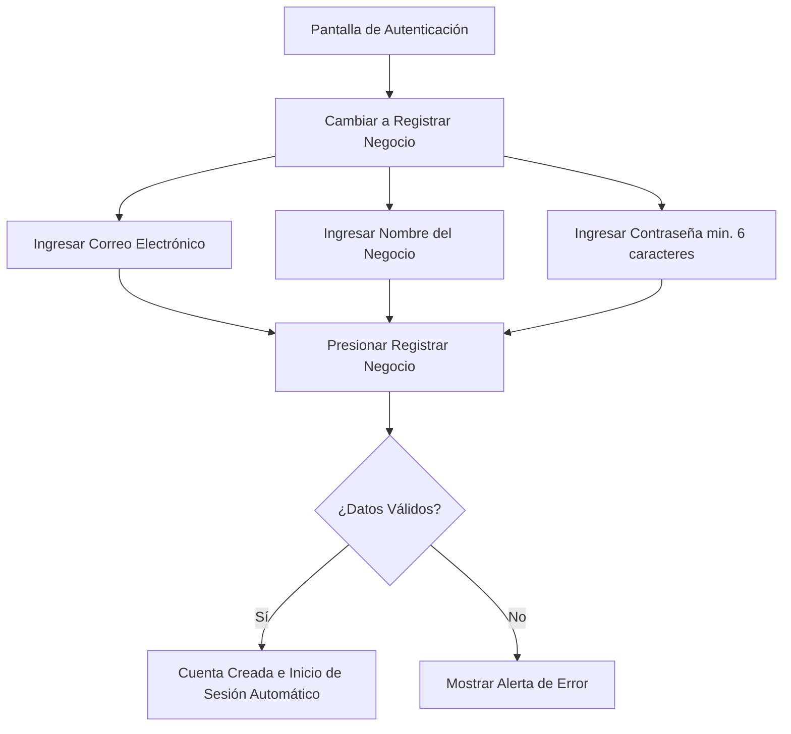

# Guía de Usuario: Registro, Ingreso y Configuración de Negocio

Esta guía explica detalladamente los pasos para crear su cuenta, ingresar a la plataforma, configurar el perfil de su negocio de comida rápida e instalar la aplicación en su dispositivo móvil para una experiencia óptima.

---

## 📱 Instalación como PWA (Aplicación Web Progresiva)

El **Estimador de Costos** está diseñado bajo un enfoque móvil-primero (*mobile-first*) y funciona como una **PWA (Progressive Web App)**. Esto significa que puede instalarla en su teléfono celular sin necesidad de descargarla de una tienda de aplicaciones, y se ejecutará a pantalla completa como si fuera una aplicación nativa.

### Pasos para instalar en Android (Google Chrome):
1. Asegúrese de que su computadora y su teléfono móvil estén conectados a la **misma red Wi-Fi** durante el desarrollo, o acceda a la URL pública del servidor.
2. Abra **Google Chrome** en su teléfono e ingrese la dirección IP de red provista por la consola de ejecución (por ejemplo, `http://192.168.1.45:5173`).
3. Presione el botón de **menú de tres puntos** en la esquina superior derecha del navegador.
4. Seleccione la opción **"Agregar a la pantalla principal"** o **"Instalar aplicación"**.
5. Confirme la instalación. En unos segundos, aparecerá un ícono de la aplicación en la pantalla de inicio de su teléfono. Al abrirlo, se ejecutará sin barras de direcciones del navegador.

> [!NOTE]
> La aplicación se adapta automáticamente a zonas seguras de pantalla en dispositivos modernos, utilizando las configuraciones de borde a borde (*safe-area-inset-bottom*), permitiendo una interacción fluida con gestos del sistema operativo.

---

## 🔐 Registro de una Cuenta Nueva

Si es la primera vez que utiliza la aplicación, debe registrar su negocio.

### Instrucciones paso a paso para el registro:
1. Abra la aplicación en su dispositivo. Verá la pantalla de **¡Bienvenido de Nuevo!**.
2. Toque el botón **"¿No tienes cuenta? Registrate aquí"** ubicado en la parte inferior de la tarjeta.
3. El formulario cambiará su título a **Crear Tu Cuenta**.
4. Ingrese los siguientes datos:
   * **Correo Electrónico**: Su dirección de correo electrónico de contacto (por ejemplo, `admin@donpepe.com`). Este campo es obligatorio.
   * **Nombre del Negocio**: El nombre comercial de su local (por ejemplo, `Hamburguesas Don Pepe`). Este nombre se mostrará en las cabeceras de toda la aplicación.
   * **Contraseña**: Defina una contraseña segura. 
5. Toque el botón **"Registrar Negocio"**.

> [!IMPORTANT]
> **Validaciones de Seguridad:**
> * La contraseña debe poseer una longitud mínima de **6 caracteres**.
> * Todos los campos marcados como requeridos deben estar completos. Si hay algún error, se mostrará una caja de alerta roja con el mensaje correspondiente (ej. *"La contraseña debe tener al menos 6 caracteres"*).

---

## 🔑 Inicio de Sesión (Ingreso)

Una vez registrado, puede iniciar sesión desde cualquier dispositivo:

1. En la pantalla inicial de autenticación, asegúrese de que el título sea **¡Bienvenido de Nuevo!**. Si no lo es, toque la opción **"¿Ya tienes cuenta? Inicia sesión"**.
2. Escriba su **Correo Electrónico** y **Contraseña**.
3. Puede verificar los caracteres de su contraseña tocando el ícono de **Ojo** (mostrar/ocultar contraseña) situado al extremo derecho del campo de texto.
4. Presione el botón **"Iniciar Sesión"**. Se mostrará un indicador de carga en lo que se validan sus credenciales y se le redirige al panel inicial.

---

## 🏢 Perfil y Cabecera del Negocio

Una vez dentro de la aplicación, en la parte superior de la pantalla se visualizará la barra de título fija (Header):

* **🍔 Costos Comida**: Es el nombre oficial de la plataforma.
* **Nombre de su Negocio**: Justo debajo del título principal, aparecerá en texto secundario el nombre del negocio ingresado durante el registro (por ejemplo: `Hamburguesas Don Pepe`).
* **Botón de Salida (Cerrar Sesión)**: Un botón rojo con el ícono de salida (`LogOut`) situado en la esquina superior derecha le permitirá cerrar sesión de forma segura y borrar sus credenciales activas del almacenamiento del dispositivo.

---

## 🧭 Navegación Táctil en Móviles

La aplicación cuenta con una barra de navegación inferior fija adaptada para el pulgar, facilitando la alternancia entre secciones:

| Ícono | Pestaña | Descripción |
| :---: | :--- | :--- |
| **`LayoutDashboard`** | **Inicio** | Resumen financiero global, contador de catálogo y sugerencias de costos. |
| **`FolderHeart`** | **Insumos** | Registro de materias primas a granel y calculadora de porciones. |
| **`ChefHat`** | **Recetas** | Creación y costeo de platillos individuales del menú. |
| **`Receipt`** | **Gastos** | Administración de costos operativos e indirectos (renta, servicios, salarios). |
| **`TrendingUp`** | **Simulador** | Tablero de simulación de volumen de ventas diario y proyección de utilidades netas. |

> [!TIP]
> La pestaña activa se destacará con el color principal del tema (naranja/rojo de comida rápida) y el ícono se ampliará ligeramente de escala de forma animada para confirmar visualmente su selección.
