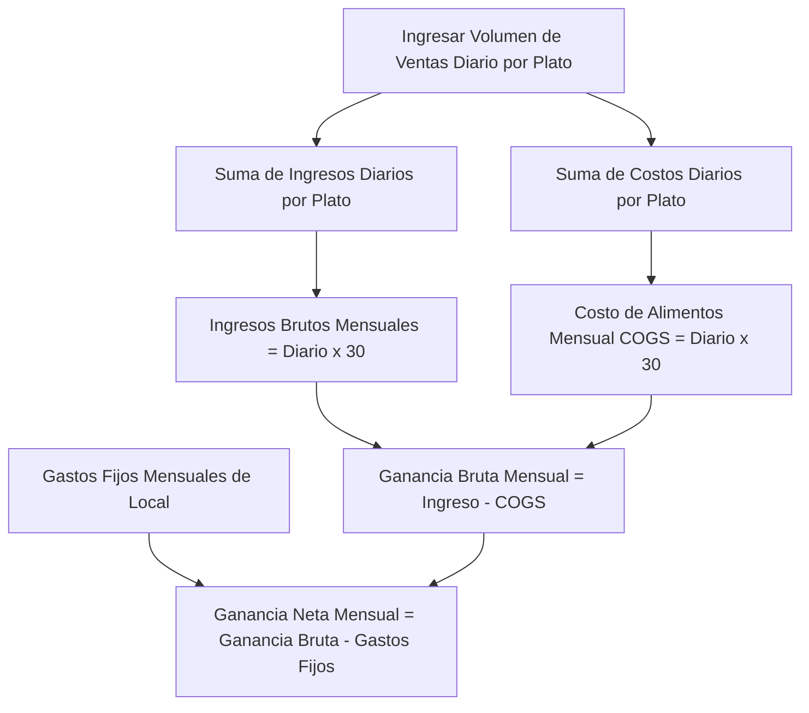

# Guía de Usuario: Simulador de Ventas y Proyección de Ganancias Netas

Esta guía le mostrará cómo utilizar el simulador de volumen de ventas para realizar proyecciones financieras mensuales y entender cuántas unidades de cada platillo necesita vender al día para cubrir sus costos y generar ganancias netas reales.

---

## 📈 ¿Qué es el Simulador de Ventas?

El **Simulador** es un tablero interactivo (*dashboard*) que cruza los datos financieros de sus recetas (precios de venta y costos de alimentos) con sus gastos fijos operativos (renta, servicios, sueldos) para generar un pronóstico detallado de ingresos y utilidades mensuales bajo diferentes escenarios de ventas.

---

## 🖥️ Interfaz del Simulador

Para acceder al simulador, toque la pestaña **Simulador** (ícono de tendencia alcista `TrendingUp`):

1. **Panel de Proyección Mensual Simulada**: Se muestra en la parte superior e incluye cuatro indicadores globales:
   * **Ingresos Brutos**: Ventas estimadas acumuladas en 30 días de operación.
   * **Costo de Alimentos (COGS)**: Suma total de los ingredientes consumidos para esas ventas en 30 días.
   * **Gastos Fijos Local**: Suma total mensualizada de sus costos operativos de la pestaña **Gastos**.
   * **Ganancia Neta**: El dinero libre final que ingresa a su bolsillo.
2. **Botón Guardar**: En la parte media derecha, permite registrar esta simulación de ventas en la base de datos.
3. **Lista de Platillos (Ventas Diarias Estimadas)**: Tarjetas correspondientes a cada una de sus recetas del menú con controles de volumen táctil.

---

## ⚙️ Simular Volumen de Ventas Paso a Paso

1. Para cada platillo del menú, verá un cuadro numérico al lado derecho con el texto `/día`.
2. Toque el cuadro e ingrese la cantidad aproximada de unidades que vende (o planea vender) en un solo día de ese platillo (ej. `25` hamburguesas sencillas, `15` combos dobles).
3. Conforme escriba o cambie los números, observará que los valores en el panel superior de **Proyección Mensual Simulada** se actualizan de forma instantánea en tiempo real.
4. En la parte inferior de cada tarjeta se mostrará el subtotal diario:
   * **Ingreso Diario**: $\text{Precio de Venta} \times \text{Unidades Vendidas}$.
   * **Ganancia Bruta Diaria**: $\text{Margen de Utilidad por Plato} \times \text{Unidades Vendidas}$ (destacado en color verde).

> [!TIP]
> Si no planea vender un platillo determinado o solo es de temporada, simplemente mantenga su volumen diario en `0`.

---

## 📐 Fórmulas y Cálculos Financieros del Tablero

La aplicación utiliza la siguiente lógica matemática para proyectar los resultados mensuales (basados en un mes estándar de **30 días**):

### 1. Ingresos Brutos Mensuales
Representa las ventas brutas acumuladas por el negocio:
$$\text{Ingresos Brutos Mensuales} = \sum (\text{Precio de Venta de cada receta} \times \text{Volumen Diario}) \times 30$$

### 2. Costo de Alimentos Mensual (COGS Mensual)
El costo total de la materia prima que se consumirá para abastecer ese volumen de ventas proyectado:
$$\text{Costo de Alimentos Mensual} = \sum (\text{Costo de Ingredientes de cada receta} \times \text{Volumen Diario}) \times 30$$

### 3. Ganancia Bruta Mensual
Dinero disponible después de sustraer los ingredientes, antes de pagar los gastos del local:
$$\text{Ganancia Bruta Mensual} = \text{Ingresos Brutos Mensuales} - \text{Costo de Alimentos Mensual}$$

### 4. Ganancia Neta Mensual
El rendimiento real y libre del negocio de comida rápida:
$$\text{Ganancia Neta Mensual} = \text{Ganancia Bruta Mensual} - \text{Gastos Fijos Mensuales}$$

---

## 🚦 Semáforo de Viabilidad Financiera (Ganancia Neta)

La cifra de **Ganancia Neta** en el panel superior cambiará de color de acuerdo al resultado de su simulación:

* 🟢 **Verde (Resultado Positivo/Superávit)**: Sus ingresos diarios cubren holgadamente el costo de los insumos y además amortizan el costo del local, dejando una utilidad neta.
* 🔴 **Rojo (Resultado Negativo/Déficit o Pérdida)**: Sus ventas diarias no alcanzan a pagar la estructura de gastos operativos fijos. Debe incrementar el volumen de ventas, ajustar precios o recortar costos operativos.

---

## 💾 Guardar Proyecciones y su Impacto en el Dashboard

Una vez que configure un escenario de ventas realista con el que desee trabajar, presione el botón **"Guardar"** (ícono de disco flexible `Save`):

1. Recibirá una alerta en color verde que indica: **"¡Proyecciones guardadas exitosamente!"**.
2. **Integración con la Pantalla Principal (Dashboard)**: Al guardar, estas cifras de ventas diarias se graban en su perfil de usuario. Cuando regrese a la pestaña **Inicio** (Dashboard), el indicador principal de **Rentabilidad Mensual (Neta Proyectada)** se actualizará con esta misma ganancia neta simulada, permitiéndole dar seguimiento diario al rendimiento operativo global de su negocio.
